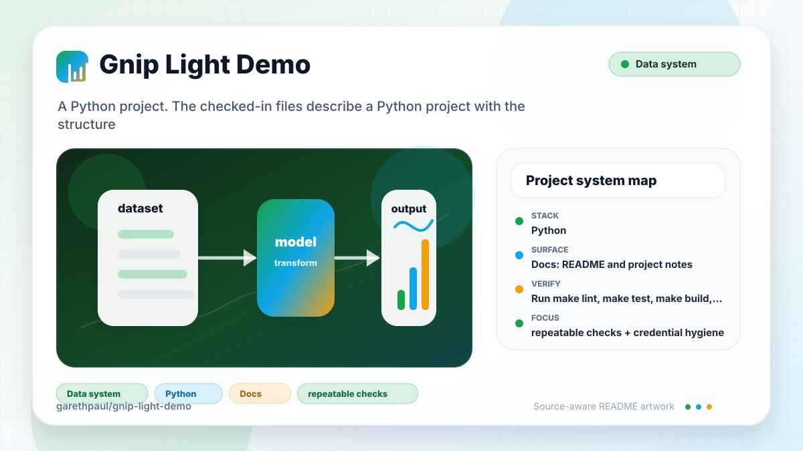

# gnip-light-demo

<!-- README-OVERVIEW-IMAGE -->


## Overview

`garethpaul/gnip-light-demo` is a Python project. The checked-in files describe a Python project with the structure summarized below.

This README is based on the checked-in source, manifests, scripts, and repository metadata on the `master` branch. The project language mix found during review was: Python (7).

## Repository Contents

- `CHANGES.md` - concise history of maintenance changes
- `Makefile` - local verification entry point
- `README.md` - project overview and local usage notes
- `requirements.txt` - Python dependency or packaging metadata
- `scripts/check-baseline.py` - static legacy GNIP demo checks
- `tests/test_timeframe.py` - local unit coverage for timeframe behavior
- `gnip_search` - source or example code
- `SECURITY.md` - security reporting and disclosure guidance
- `VISION.md` - project direction and maintenance guardrails

Additional scan context:

- Source directories: gnip_search
- Dependency and build manifests: requirements.txt
- Entry points or build surfaces: Makefile, step1.py, step2.py
- Test-looking files: scripts/check-baseline.py, tests/test_timeframe.py

## Getting Started

### Prerequisites

- Git
- Python matching the era of the project
- Python 3 for static verification

### Setup

```bash
git clone https://github.com/garethpaul/gnip-light-demo.git
cd gnip-light-demo
python -m pip install -r requirements.txt
```

The setup commands above are derived from repository files. Legacy mobile, Python, or JavaScript samples may require older SDKs or package versions than a modern workstation uses by default.

## Running or Using the Project

- Set `GNIP_USER_NAME`, `GNIP_PASSWORD`, and `GNIP_SEARCH_ENDPOINT` in the local environment before live API calls.
- `step1.py` prints retrieved data for the sample query.
- `step2.py` writes the sample CSV export; generated exports are intentionally ignored.
- Missing GNIP environment variables raise a clear configuration error before the request is built.

## Testing and Verification

- Run `make check` for static syntax, timeframe unit coverage, and credential/dependency guardrails that do not require GNIP credentials.
- Live GNIP calls still require local credentials and compatible legacy dependencies.

When the required SDK or runtime is unavailable, use static checks and source review first, then verify on a machine that has the matching platform toolchain.

## Configuration and Secrets

- Detected references to Twitter. Keep API keys, OAuth credentials, tokens, and account-specific values in local configuration only.
- GNIP credentials must come from `GNIP_USER_NAME`, `GNIP_PASSWORD`, and `GNIP_SEARCH_ENDPOINT`; do not commit credentials or retrieved tweet exports.
- GNIP HTTP error responses call `raise_for_status()` so live failures surface instead of being parsed as result data.

## Security and Privacy Notes

- Review changes touching authentication or token handling; examples from the scan include gnip_search/gnip_search_api.py.
- Review changes touching external API calls or credential-adjacent configuration; examples from the scan include gnip_search/gnip_search_api.py, requirements.txt, step2.py.
- Review changes touching network requests, sockets, or service endpoints; examples from the scan include gnip_search/gnip_search_api.py.
- Review changes touching file, media, JSON, XML, CSV, OCR, or data parsing; examples from the scan include gnip_search/gnip_search_api.py, step2.py.

## Maintenance Notes

- This is a legacy Python 2 sample. Keep Python 2/API compatibility changes separate from static hardening where practical.
- See `SECURITY.md` for vulnerability reporting and safe research guidance.
- See `VISION.md` for project direction and contribution guardrails.

## Contributing

Keep changes small and tied to the project that is already present in this repository. For code changes, document the toolchain used, avoid committing generated dependency directories or local configuration, and update this README when setup or verification steps change.
